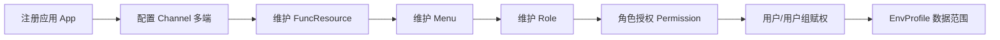

# EMS 应用权限集成说明

本文说明 EMS（Enterprise Management System）如何将业务应用接入统一门户，并完成**功能资源、菜单、角色、用户组、业务场景**等层面的权限集成。适用于平台管理员、应用接入方与二次开发者。

---

## 1. 概述

EMS 作为统一认证与授权中心，业务应用在门户中以「已注册应用」的形式出现。权限体系分为三层：

| 层次 | 解决什么问题 | 主要载体 |
|------|--------------|----------|
| **功能权限** | 用户能否访问某功能/URL | 角色 × 功能资源（`FuncPermission`） |
| **场景限定** | 上述授权在哪些业务场景下生效 | 应用/角色/成员的 `envIds`，以及角色×应用×场景（`RoleAppEnv`） |
| **数据范围** | 在场景下能看哪些业务数据 | 用户场景配置（`EnvProfile`）中的维度属性 |

门户侧负责注册应用、维护菜单与授权；业务应用通过 `ems-app` SDK 拉取资源权限表做运行时鉴权，菜单由门户按用户、端类型、当前场景过滤后下发。

---

## 2. 核心概念与关系

```
Org（组织）
 └─ Domain（业务域 / 按 hostname）
     ├─ Env（业务场景）
     ├─ AppGroup（应用分组）
     │    └─ App（应用，HasEnvIds）
     │         ├─ Channel（端：PC / 移动…）
     │         │    └─ Menu（菜单树）──M:N── FuncResource（功能资源）
     │         └─ FuncResource
     ├─ Role（角色，HasEnvIds，可树形）
     │    ├─ RoleMember（用户↔角色；member/granter/manager；HasEnvIds）
     │    ├─ FuncPermission（角色 × 功能资源，与场景无关）
     │    └─ RoleAppEnv（角色 × 应用 × 场景）
     └─ EnvProfile（用户 × 域 × 场景 + 数据维度）

Group（用户组，组织级）
 └─ roles → 用户通过默认组/附加组继承角色
```

### 2.1 应用（App）

- 隶属于某个 **Domain** 与 **AppGroup**。
- `base`：应用默认上下文地址（Channel 可覆盖）。
- 实现 `HasEnvIds`：`envIds` 为空表示**适用全部业务场景**；非空则仅在所列场景下可用。
- 可配置数据源等运维信息；门户导航要求应用至少有一个 **Channel**。

### 2.2 业务场景（Env）

- 域级概念，表示「本专科 / 微专业」等**业务场景**，不是部署环境（dev/prod）。
- 用户登录后可选场景；会话中的 `profileId` 实际对应 **Env.id**，用于菜单过滤与数据配置切换。

### 2.3 端与多端（Channel）

同一应用可有多套面向不同终端的入口：

| 概念 | 说明 |
|------|------|
| **ChannelType** | 端类型，如 `pc`、`mobile` |
| **Channel** | 应用下某一端的配置：独立 `base`、嵌入方式、菜单树 |
| **EmbedMode** | 门户嵌入方式：`wujie`（微前端）或 `iframe` |

要点：

- 菜单挂在 **Channel** 上，同一 App 可为 PC / 移动分别建菜单。
- 功能资源（`FuncResource`）仍归属于 **App**，各端共享同一套资源与角色授权；差异主要在菜单组织与嵌入地址。
- 门户 Shell 打开菜单时，按 Channel 的 `embedMode` 与 `base` 加载子应用。

### 2.4 功能资源与菜单

| 实体 | 说明 |
|------|------|
| **FuncResource** | 可授权的功能单元（通常对应模块/URL），归属 App；有可见范围（Public/Private 等）与启用状态 |
| **Menu** | 导航树节点，归属 Channel；可关联多个 FuncResource；用户至少对其中一个资源有权时菜单才可见 |

菜单决定「看见什么」；资源权限决定「能否访问」。无菜单入口的资源仍可通过直接 URL 访问，由应用侧 Authorizer 拦截。

### 2.5 角色、用户组、成员

| 概念 | 作用 |
|------|------|
| **Role** | 权限载体；可树形；带 `envIds` 限制角色本身适用场景 |
| **RoleMember** | 用户与角色关系；`member` 持权、`granter` 可转授、`manager` 可管角色；成员也可带 `envIds` |
| **Group** | 组织级用户组，绑定一组 Role，便于批量赋权；用户通过默认组/附加组继承 |

有效角色 ≈ 用户作为 **member** 的角色 ∪ 所属用户组上的角色，再按当前场景做 `suitable(env)` 过滤。

### 2.6 用户场景配置（EnvProfile）

- 用户在某一 Domain、某一 Env 下的**数据范围**配置（维度如部门、校区等，存于 `properties`）。
- 与功能授权解耦：有菜单权限不等于能看全部业务数据；数据过滤依赖 EnvProfile 与业务侧实现。

### 2.7 场景适用规则（HasEnvIds）

`App`、`Role`、`RoleMember` 共用约定：

- **`envIds` 为空**：不限制场景；
- **非空**：仅当当前 Env 落在集合中时适用。

角色在某应用上的场景进一步由 **RoleAppEnv** 约束（见下节）。

---

## 3. 授权模型

### 3.1 功能授权：FuncPermission

```
Role ──FuncPermission──▶ FuncResource（属于 App）
```

- 一行表示：某角色拥有某功能资源（可含 actions / restrictions）。
- **与业务场景无关**：是否「在某场景下生效」不写在 FuncPermission 上。

### 3.2 场景限定：RoleAppEnv

```
Role × App × Env（RoleAppEnv，一行一个场景）
```

| RoleAppEnv | 含义 |
|------------|------|
| **无记录** | 该角色在该应用上的功能授权**不限制场景**（全部场景） |
| **有多条** | 仅在这些场景下，该角色对该应用的菜单/能力按场景过滤生效 |

授权保存时：

- 选择「全部场景」→ 清空该角色×应用的 RoleAppEnv；
- 选择具体场景 → 按 Env 写入多条 RoleAppEnv。

若 **App.envIds** 非空，授权界面必须在应用允许的场景范围内勾选，且至少选一个，不能选「全部场景」。

### 3.3 三层场景叠加（理解顺序）

对「用户 U 在场景 E 下能否通过角色 R 使用应用 A」可按下列过滤理解：

1. `RoleMember.suitable(E)`、`Role.suitable(E)`；
2. `App.suitable(E)`；
3. 若存在 `RoleAppEnv(R,A,*)`，则 E 必须在其中；无记录则不额外限制；
4. 再检查是否存在 `FuncPermission(R, resource∈A)`。

URL 级鉴权（Authorizer）主要依据角色与资源；场景更多影响**菜单可见性**与**数据配置**，避免把场景写进每一条功能权限。

---

## 4. 管理端配置流程

推荐接入顺序：



1. **应用管理**：名称、标题、`base`、分组、适用业务场景（`envIds`）、数据源等。  
2. **端（Channel）**：每个 `(app, channelType)` 唯一；配置 `base`、嵌入方式（wujie / iframe）。  
3. **功能资源**：在应用下登记资源；也可随菜单 XML 导入。  
4. **菜单**：在指定 Channel 下建树，关联资源；可为 PC/移动分别维护。  
5. **角色**：建角色树，可选限定角色适用场景。  
6. **角色授权**：选择应用 → 勾选菜单/资源 → 选择全部或具体场景 → 保存（写 FuncPermission + RoleAppEnv）。  
7. **用户**：分配角色成员（及成员级场景）、用户组；配置 EnvProfile。

授权变更后门户会发布数据事件；业务应用侧定期或订阅刷新权限缓存。

---

## 5. 运行时行为

### 5.1 门户自身

- 使用本地 Authorizer，按本应用的 FuncResource / FuncPermission 做基于角色的 URL 鉴权。
- 导航：按用户、**ChannelType（端）**、当前 **Env** 计算可见菜单，再按 Channel 嵌入子应用。

### 5.2 业务应用（ems-app）

1. 配置应用名与门户 API 地址。  
2. `RemoteAuthorizer` 拉取该应用的资源-角色权限表。  
3. 定时刷新；亦可订阅门户权限变更事件。  
4. 请求进入时按用户角色判断是否拥有对应资源。

### 5.3 菜单下发

- 有效角色 = 成员角色 ∪ 用户组角色，并按场景过滤。  
- 排除：应用不适配当前场景、或 RoleAppEnv 排除当前场景的应用菜单。  
- 菜单可见当且仅当用户对关联资源之一有 FuncPermission。

---

## 6. 应用多端说明

「一个应用、多端访问」在 EMS 中的标准做法：

| 维度 | 做法 |
|------|------|
| **端类型** | 为同一 App 创建多个 Channel（如 PC、移动） |
| **入口地址** | Channel.base（可不同于 App.base，便于不同端部署） |
| **导航结构** | 每套 Channel 独立菜单树 |
| **嵌入方式** | 每套 Channel 独立选择 wujie 或 iframe |
| **权限** | 功能资源与角色授权仍在 App 级统一；多端共享同一授权结果 |
| **业务场景** | 与端正交：同一端下仍可按 Env 切换场景 |

示例：

- 教务应用：PC Channel（wujie → `https://jw.example/pc`）+ 移动 Channel（iframe → `https://jw.example/m`）；  
- 两端菜单不同，但「成绩查询」等资源只需授权一次；  
- 用户切换「本专科 / 研究生」场景后，两端菜单均可按 RoleAppEnv / App.envIds 同步过滤。

---

## 7. 角色 / 用户组 / 场景 / 配置对照

| | 角色 Role | 用户组 Group | 业务场景 Env | 场景配置 EnvProfile |
|--|-----------|--------------|--------------|---------------------|
| 主要职责 | 功能权限载体 | 批量绑定角色 | 业务语境切换 | 数据维度范围 |
| 与场景 | Role.envIds；RoleAppEnv | 无 | 实体本身 | 绑定某一个 Env |
| 用户如何获得 | RoleMember | 默认组/附加组 | 登录/切换 | 管理员配置 |
| 影响面 | URL + 菜单 | 同角色 | 菜单/应用可见性 | 业务数据过滤 |

---

## 8. 接入检查清单

业务应用接入 EMS 权限时建议确认：

- [ ] 门户已注册 App，且 `name` 与应用配置一致  
- [ ] 至少配置一个 Channel（否则无法进入门户 Web 应用导航）  
- [ ] 功能资源已登记，命名与应用内鉴权路径一致  
- [ ] 菜单已挂到对应 Channel，并关联资源  
- [ ] 角色已授权所需资源；需要按场景限制时已配置 RoleAppEnv  
- [ ] 用户已获得角色或用户组；需要时已配置 EnvProfile  
- [ ] 应用已启用 `RemoteAuthorizer`（或等价机制）并能拉取权限  

---

## 9. 关键代码位置

| 类别 | 路径 |
|------|------|
| 应用 / 场景 / 端类型 | `portal/.../config/model/App.scala`、`Env.scala`、`HasEnvIds.scala`、`ChannelType.scala`、`EmbedMode.scala` |
| 通道 / 菜单 / 权限 | `portal/.../security/model/Channel.scala`、`Menu.scala`、`function.scala`（FuncResource、FuncPermission、RoleAppEnv） |
| 角色 / 组 / 配置 | `portal/.../user/model/Role.scala`、`RoleMember.scala`、`Group.scala`、`EnvProfile.scala` |
| 授权服务 | `portal/.../security/service/impl/FuncPermissionManagerImpl.scala`、`MenuServiceImpl.scala` |
| 管理界面 | `AppAction`、`ChannelAction`、`FuncResourceAction`、`MenuAction`、`PermissionAction`、`RoleAction` |
| 应用 SDK | `app/.../security/RemoteAuthorizer.scala`、`RemoteService.scala` |
| 权限 WS | `portal/.../ws/security/func/ResourceWS.scala`、`MenuWS.scala` |
| 门户 Shell | `packages/ems-shell/`（wujie / iframe 打开子应用） |

---

## 10. 小结

- EMS 用 **App + Channel** 描述「一个应用、多端入口」，用 **FuncResource + FuncPermission** 描述功能授权，用 **Env + RoleAppEnv + HasEnvIds** 描述场景边界，用 **EnvProfile** 描述数据范围。  
- 功能授权与场景限定分离，避免权限表膨胀，又支持「同一角色在不同场景下看到不同应用能力」。  
- 业务应用只需实现远程鉴权与资源命名约定，菜单与场景切换由门户统一完成。
